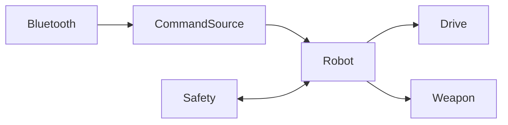
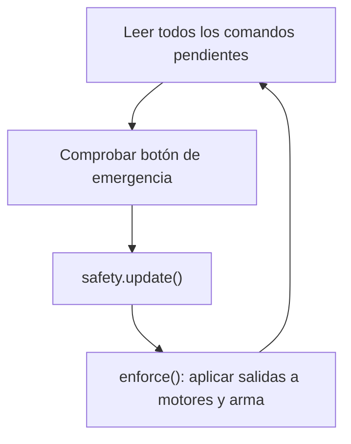
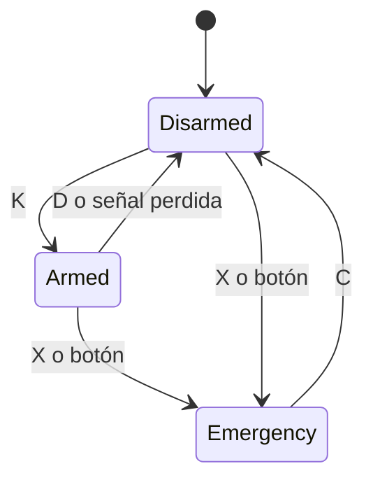

# Documentación del código — Mini BattleBot (modelo base)

Robot de 4 ruedas con sierra frontal, controlado por Bluetooth. El código está pensado para que se pueda reutilizar con otros tipos de armas, tracciones y sistemas de control.

---

## 1. Visión general

El sketch se divide en **7 archivos**, uno por categoría. Cada categoría tiene una responsabilidad única y se comunica con las demás a través de interfaces simples.

| Archivo | Categoría | Responsabilidad |
|---|---|---|
| `BattleBot.ino` | Ensamblaje | Crea los objetos y llama a `robot.begin()` y `robot.update()` |
| `Config.h` | Configuración | Pines, velocidades, potencia de la sierra y tiempo de failsafe |
| `Command.h` | Protocolo | Lista de comandos internos (`enum class Command`) |
| `Input.h` | Entrada | Recibe datos y los convierte en comandos (`BluetoothInput`) |
| `Drive.h` | Movimiento | Motores y tracción (`Motor`, `DifferentialDrive`) |
| `Weapon.h` | Ataque | Armas (`SawWeapon`, `ServoWeapon`) |
| `Safety.h` | Seguridad | Estados armado/desarmado/emergencia y failsafe |
| `Robot.h` | Lógica central | Une todas las categorías y aplica las reglas |

### Cómo se conectan



`Robot` no sabe qué tipo de entrada, tracción o arma usa. Solo conoce las interfaces `CommandSource`, `Drive` y `Weapon`. Por eso se pueden cambiar sin tocar la lógica.

---

## 2. Ciclo de ejecución

`loop()` solo llama a `robot.update()`, que repite estos pasos sin usar `delay()`:



1. **Leer comandos:** se procesan todos los caracteres recibidos en ese ciclo.
2. **Botón de emergencia:** si el pin 12 está en LOW, se ejecuta la emergencia.
3. **Actualizar seguridad:** si se perdió la señal, se desarma.
4. **Aplicar salidas (`enforce`):** los motores y el arma se ajustan según lo que pidió el usuario **y** lo que permite la seguridad.

La lógica funciona con **estado deseado**: los comandos solo guardan qué se quiere (`throttle`, `turn`, `weaponWanted`). Las salidas físicas se calculan siempre en `enforce()`, así ninguna parte del código puede saltarse las protecciones.

---

## 3. Protocolo de comandos

Cada comando es **un carácter** enviado por Bluetooth serie a 9600 baud.

| Carácter | Comando | Efecto |
|---|---|---|
| `F` | Forward | Avanza |
| `B` | Backward | Retrocede |
| `L` | Left | Gira a la izquierda sobre su eje |
| `R` | Right | Gira a la derecha sobre su eje |
| `S` | Stop | Detiene el movimiento |
| `W` | WeaponOn | Enciende el arma (solo si está armado) |
| `w` | WeaponOff | Apaga el arma |
| `K` | Arm | Arma el robot |
| `D` | Disarm | Desarma el robot y apaga el arma |
| `X` | Emergency | Parada de emergencia |
| `C` | ClearEmergency | Sale de emergencia (queda desarmado) |
| `H` | Heartbeat | No hace nada, solo confirma que hay señal |

- Los caracteres no reconocidos (saltos de línea, ruido) se ignoran y **no** renuevan el failsafe.
- Los movimientos son **estados**, no pulsos: el robot sigue avanzando hasta recibir `S`, otro movimiento o perder la señal.
- **Para el botón de ataque:** la app envía `W` al presionar y `w` al soltar.

---

## 4. Módulos en detalle

### 4.1 Configuración (`Config.h`)

Todo lo ajustable está en el namespace `Config`.

| Constante | Valor | Uso |
|---|---|---|
| `BT_RX_PIN` / `BT_TX_PIN` | 2 / 4 | Pines del módulo Bluetooth |
| `BT_BAUD` | 9600 | Velocidad del módulo |
| `LEFT_PWM`, `LEFT_IN1`, `LEFT_IN2` | 5, 7, 8 | Motores del lado izquierdo |
| `RIGHT_PWM`, `RIGHT_IN1`, `RIGHT_IN2` | 6, 9, 10 | Motores del lado derecho |
| `WEAPON_PIN` | 11 | Salida PWM hacia el MOSFET de la sierra |
| `EMERGENCY_PIN` | 12 | Botón de emergencia (a GND) |
| `DRIVE_SPEED` | 200 | Velocidad al avanzar o retroceder (0–255) |
| `TURN_SPEED` | 170 | Velocidad al girar (0–255) |
| `WEAPON_POWER` | 255 | Potencia de la sierra (0–255) |
| `SIGNAL_TIMEOUT_MS` | 1000 | Tiempo sin señal antes del failsafe |

### 4.2 Entrada (`Input.h`)

- `CommandSource` es una interfaz con dos métodos: `begin()` y `read()`.
- `read()` devuelve un `Command` por llamada, o `Command::None` si no hay datos.
- `BluetoothInput` usa `SoftwareSerial` y traduce cada carácter con la función `decode()`.

### 4.3 Movimiento (`Drive.h`)

- **`Motor`:** controla un canal de driver con tres pines (PWM y dos de dirección). `set(velocidad)` acepta de -255 a 255: el signo define el sentido y el valor absoluto el PWM.
- **`Drive`:** interfaz con `begin()`, `move(throttle, turn)` y `stop()`.
- **`DifferentialDrive`:** tracción de dos lados (las dos ruedas de cada lado en paralelo).

```cpp
left  = throttle + turn;
right = throttle - turn;
```

| Comando | throttle | turn | Izquierda | Derecha |
|---|---|---|---|---|
| Forward | 200 | 0 | 200 | 200 |
| Backward | -200 | 0 | -200 | -200 |
| Left | 0 | -170 | -170 | 170 |
| Right | 0 | 170 | 170 | -170 |

### 4.4 Armas (`Weapon.h`)

La interfaz `Weapon` define cuatro métodos:

| Método | Significado |
|---|---|
| `begin()` | Configura pines y deja el arma segura |
| `engage()` | Activa el arma |
| `release()` | Desactiva el arma en uso normal |
| `safe()` | Deja el arma en estado seguro (emergencia y arranque) |

- **`SawWeapon`:** PWM al motor de la sierra. `engage()` aplica `WEAPON_POWER`, y `release()` y `safe()` ponen 0.
- **`ServoWeapon`:** ejemplo para martillos o lifters. `engage()` mueve el servo al ángulo de golpe y `release()` y `safe()` lo devuelven al reposo.

### 4.5 Seguridad (`Safety.h`)

Tiene tres estados:



| Estado | Movimiento | Arma |
|---|---|---|
| **Disarmed** (inicial) | Permitido | Bloqueada |
| **Armed** | Permitido | Permitida con `W` |
| **Emergency** | Bloqueado | Bloqueada |

Reglas importantes:

- **Failsafe:** `feed()` guarda la hora de la última señal válida. `signalLost()` es verdadero si pasó más de `SIGNAL_TIMEOUT_MS`.
- Si se pierde la señal estando **Armed**, `update()` pasa a **Disarmed**. Al volver la señal hay que armar de nuevo con `K`.
- `arm()` solo funciona desde **Disarmed** y con señal activa.
- **Emergency** es un **bloqueo**: solo se sale con `C`. Ni una señal nueva ni soltar el botón físico lo quitan.
- El cálculo de tiempo con `millis()` usa aritmética sin signo, así que funciona aunque el contador se reinicie.

### 4.6 Lógica central (`Robot.h`)

`Robot` recibe por constructor una entrada, una tracción, un arma y el sistema de seguridad.

- **`handle(comando)`:** ignora `Unknown`. Cualquier otro comando renueva el failsafe y actualiza el estado deseado. `WeaponOn` solo se acepta si `safety.isArmed()`.
- **`enforce()`:**
  - Si `canDrive()`, aplica `drive.move(throttle, turn)`. Si no, pone los valores a cero y detiene los motores.
  - Si el robot está armado y `weaponWanted`, llama a `weapon.engage()`. Si no, pone `weaponWanted = false` y llama a `weapon.release()`.
- **`emergencyStop()`:** activa el estado de emergencia, borra todo lo pedido y ejecuta `shutdownOutputs()` (`drive.stop()` y `weapon.safe()`). Es pública, así que se puede llamar desde cualquier parte del código.

---

## 5. Secuencia típica de un combate

1. Se enciende el robot: queda **desarmado** y quieto.
2. Se conecta el teléfono o el control por Bluetooth, que empieza a enviar `H` cada ~200 ms.
3. El equipo puede mover el robot (`F`, `B`, `L`, `R`, `S`) para posicionarlo.
4. Cuando el árbitro da la señal, se envía `K` para **armar**.
5. Durante el combate, `W` enciende la sierra al mantener presionado y `w` la apaga al soltar.
6. Si hay peligro, `X` o el botón físico detienen todo.
7. Al terminar, `D` desarma. Después de una emergencia hay que enviar `C`.

---

## 6. Cómo adaptarlo a otros robots

Solo cambia la parte de creación de objetos en `BattleBot.ino`.

**Otra arma (por ejemplo, un spinner con ESC):** crea una clase que herede de `Weapon`.

```cpp
class EscSpinner : public Weapon {
public:
  EscSpinner(uint8_t escPin) : pin(escPin) {}

  void begin() override {
    esc.attach(pin);
    safe();
  }

  void engage() override { esc.writeMicroseconds(1800); }
  void release() override { esc.writeMicroseconds(1000); }
  void safe() override { esc.writeMicroseconds(1000); }

private:
  Servo esc;
  uint8_t pin;
};
```

Después, en el `.ino`, reemplaza la línea de `SawWeapon` por `EscSpinner weapon(11);`. No hay que modificar `Robot`, `Safety` ni ninguna otra categoría.

**Otra tracción** (por ejemplo, 4 motores independientes u orugas): crea una clase que herede de `Drive` e implemente `begin()`, `move()` y `stop()`.

**Otro método de control** (radio, ESP32, Wi-Fi): crea una clase que herede de `CommandSource` y devuelva los mismos `Command`.

---

## 7. Cumplimiento con el reglamento de diseño

| Regla | Sección | Cómo se cumple |
|---|---|---|
| Failsafe de 1 s | 6.1 | `Safety::signalLost()` y `SIGNAL_TIMEOUT_MS` |
| Modo armado/desarmado | 6.5 | Estados de `Safety`; inicia **desarmado** |
| Control humano | 6.4 | Solo se mueve con comandos recibidos |
| Paro seguro | 7.4 | `emergencyStop()` |
| Interruptor principal | 4.4 | **Hardware:** no lo cubre el código |
| Protección de la cadena | 5.5 | **Mecánico:** no lo cubre el código |

---

## 8. Pruebas recomendadas antes de competir

Haz estas pruebas **sin ruedas en el suelo y con la sierra sin cadena o retirada**.

- [ ] Al encender, los motores y la sierra están apagados.
- [ ] `W` sin armar no enciende la sierra.
- [ ] Con `K`, `W` enciende la sierra y `w` la apaga.
- [ ] Mantener `F` y apagar el teléfono o alejarse detiene todo en ~1 s.
- [ ] Después de perder la señal, la sierra **no** vuelve a girar sin enviar `K`.
- [ ] `X` detiene todo y `F` o `W` no tienen efecto hasta enviar `C`.
- [ ] El botón físico del pin 12 activa la emergencia.
- [ ] `L` hace girar el robot hacia la izquierda y `R` hacia la derecha.

---

## 9. Problemas frecuentes

| Síntoma | Causa probable | Solución |
|---|---|---|
| Un lado gira al revés | Cables del motor invertidos | Invertir los cables del motor o los pines IN1/IN2 de ese lado |
| El robot se detiene al mantener una flecha | La app no envía heartbeat | Enviar `H` cada ~200 ms |
| No responde a ningún comando | Baudrate incorrecto o RX/TX cruzados | Revisar `BT_BAUD` y conectar TX del módulo a `BT_RX_PIN` |
| Giros inversos (L y R) | Lados cambiados | Intercambiar los pines izquierda/derecha en `Config.h` |
| La sierra no arranca | MOSFET no es de nivel lógico | Usar uno que conmute con 5 V |
| Motores con ruido o reinicios | Caídas de tensión al arrancar la sierra | Añadir un condensador cerca de los drivers y revisar la batería |

**Limitaciones de seguridad:** el failsafe es por software y depende de que el microcontrolador siga funcionando. Añade una resistencia pull-down en la compuerta del MOSFET de la sierra y mantén el interruptor principal físico que exige el reglamento.
